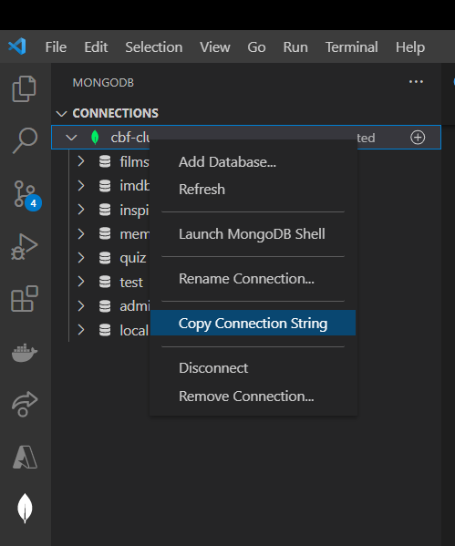
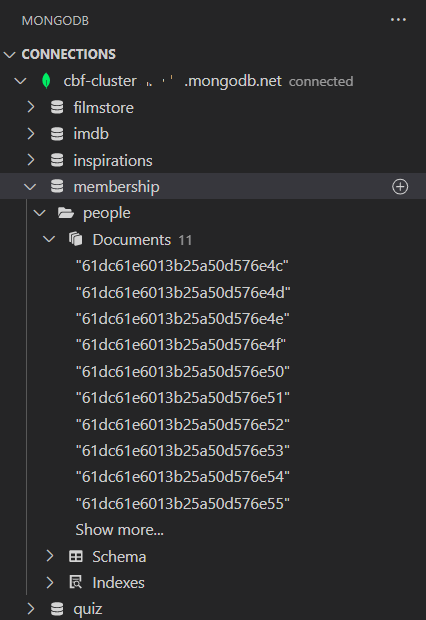
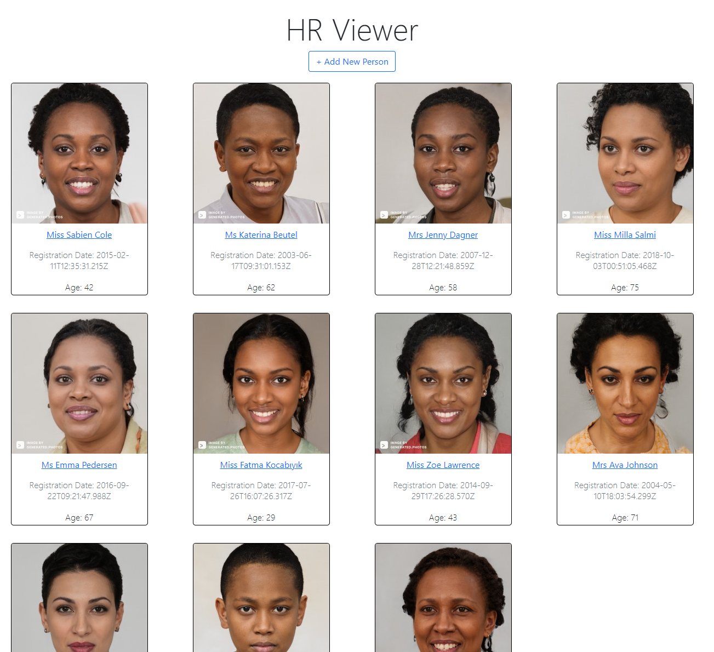
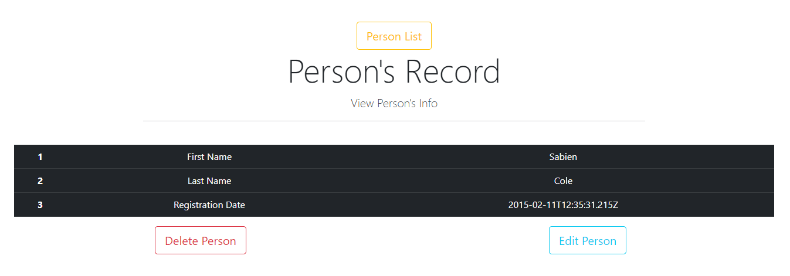

# Fullstack MERN Application: HR Viewer

For the following tasks we will finish the functionality for a fullstack MERN application.

This project consists of a:

1. MongoDB Database (`/server/seed/membership.mongodb`)
1. Node API (`/server/`)
1. React Front-End Application (`/client/`)

The application displays profile information from a database of people.

The functionality should allow a user to add, edit and delete people from the database.

Currently the application only has the functionality to display a person's details.

## Getting Started: Installation

Ensure you are running node version 16+

```
node -v
```

Go to your cloned project.

Navigate to your project root directory. Open the project folder  Visual Code and open a terminal window.

To install the project dependencies, run the following command from the root directory:

```
npm run dev-install
```

### Environment variables

We have provided you with an example environment variables file called [`.env.example`](./.env.example). Make a copy of this file called `.env` to use it.

In here, you should copy your database connection string (which you can get from the MongoDB Atlas site or VS Code) to the `MONGODB_URI` variable.

To find your connection string in Visual Studio Code, open the MongoDB extension, right-click on the connection for your instance of MongoDB Atlas and select _"Copy Connection String"_.



Make sure your connection string follows this format:

```plain
mongodb+srv://<username>:<password>@<cluster id>.mongodb.net
```

If your connection string has a database name appended as below, remove it:

```plain
mongodb+srv://<username>:<password>@<cluster id>.mongodb.net/<database name>
```

You'll also see the `MONGODB_DATABASE` value in this file. Do not change this value.

🛑 **YOUR ENVIRONMENT VARIABLES SHOULD NEVER BE COMMITED AND THE `.env` FILE HAS ALREADY BEEN ADDED TO THE [`.gitignore`](./.gitignore).** 🛑

## Install Database Seed Data

Open Visual Studio Code. Ensure you are connected to your MongoDB Instance.

Open the seed data file [membership.mongodb](/server/seed/membership.mongodb) in Visual Studio and run the file to install the `people` collection.

Once installed you should see 11 records in your MongoDB instance:



## Start the Development Server

To start the application, run the following command:

```
npm run develop
```

If your application is not working with the following error:

```
Error: error:0308010C:digital envelope routines::unsupported
```

Add the following flag to to your [/client/package.json](client/package.json) start command:

```JSON
"start": "react-scripts --openssl-legacy-provider start"
```  

## Task:

Currently the application only has the functionality to display a person's details.

Complete the application by adding the following functionality:

1. Add a new person to the application
2. Edit a person's details
3. Delete a person's profile

Visit http://localhost:3000 to view the application homepage

### Homepage View



### View Personal Details

